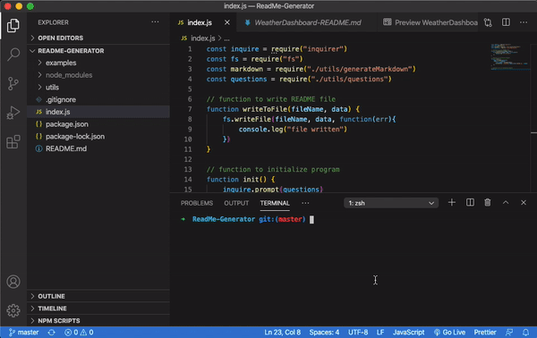

# ReadMe-Generator

## TABLE OF CONTENTS
* [Description](#description)
* [Usage](#usage)
* [Examples](#examples)
* [Questions](#questions)

## Description
A simple command line application that generates README files. When ran, the user will be presented with a series of prompts, then those inputs will be used to generate and write a README.md file to the current directory.

## Usage
To use the application, please run `node index.js` in the command line. To change the location of where you would like your file to be written, please indicate the file path on line 18 of index.js.

## Examples:
Please see the /examples directory within the repo to view a few files that were written using this application. Below is a gif that shows the process. (NOTE: Gif shows file being written to the 'examples' folder - this was only for the sake of demonstration. Current code writes file directly within the directory it is ran in.)

## Questions?
Please direct all questions to cseibert2667@gmail.com, and be sure to check out my other projects at [cseibert2667](https://www.github.com/cseibert2667).